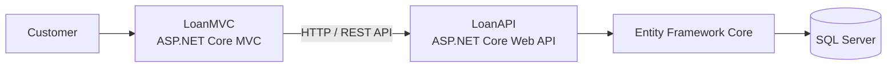

# Loan Management System

A web-based Loan Management System built using **ASP.NET Core Web API** and **ASP.NET Core MVC**. The system manages the complete loan process from customer registration and eligibility checking to loan approval, EMI schedules, document verification, and payments.


## Features

- Customer registration and profile management
- Loan application and loan type selection
- Loan approval and rejection
- Document upload and verification
- EMI schedule and payment management
- Admin and Customer role-based access
- JWT authentication with 30-minute token expiry
- Single active session per user
- BCrypt password hashing
- AES-256-GCM encryption for sensitive data

## Loan Flow

```text
Customer Registration
        ↓
Login
        ↓
Check Eligibility
        ↓
Apply for Loan
        ↓
Upload Documents
        ↓
Document Verification
        ↓
Loan Approval / Rejection
        ↓
EMI Schedule
        ↓
EMI Payment


## Architecture



## Technology Stack

* **Backend:** C#, ASP.NET Core Web API
* **Frontend:** ASP.NET Core MVC, Razor Views
* **Database:** Microsoft SQL Server
* **ORM:** Entity Framework Core
* **Authentication:** JWT
* **Password Security:** BCrypt
* **Encryption:** AES-256-GCM
* **API Testing:** Swagger / OpenAPI


## Security

JWT tokens contain the user ID, role, session ID, customer ID, and expiration time.

The system maintains a single active session for each user. Tokens expire after **30 minutes** and expired or invalid tokens are rejected by the API.

Sensitive data is encrypted using **AES-256-GCM**, while passwords are stored using BCrypt hashing.


## Project Structure

LOAN/
├── LoanAPI/
│   ├── Controllers/
│   ├── DTOs/
│   ├── Models/
│   ├── Repositories/
│   ├── Services/
│   └── Program.cs
│
├── LoanMVC/
│   ├── Controllers/
│   ├── Filters/
│   ├── Handlers/
│   ├── Services/
│   ├── Views/
│   └── Program.cs
│
└── .gitignore


## Running the Project

### LoanAPI

cd LoanAPI
dotnet ef database update
dotnet run

### LoanMVC

cd LoanMVC
dotnet run


## Project Objective

To develop a secure loan management platform that handles customer management, loan processing, document verification, EMI payments, and authentication using a layered **ASP.NET Core** architecture.

